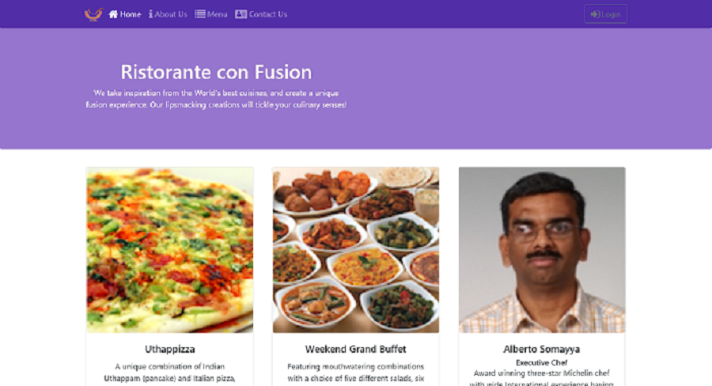
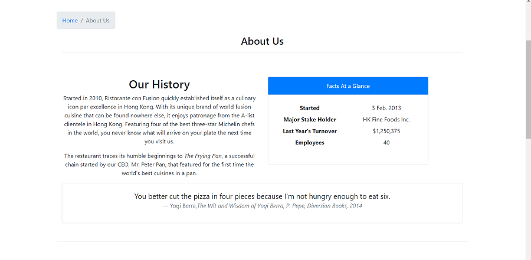
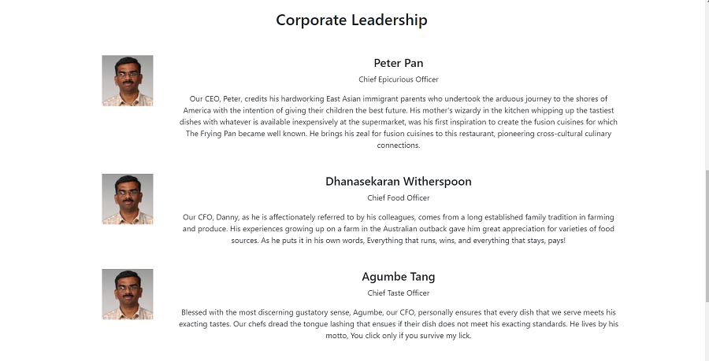
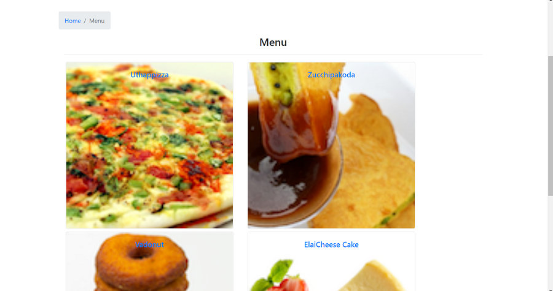
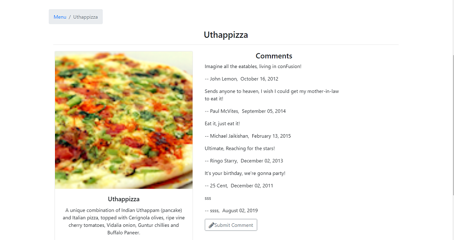
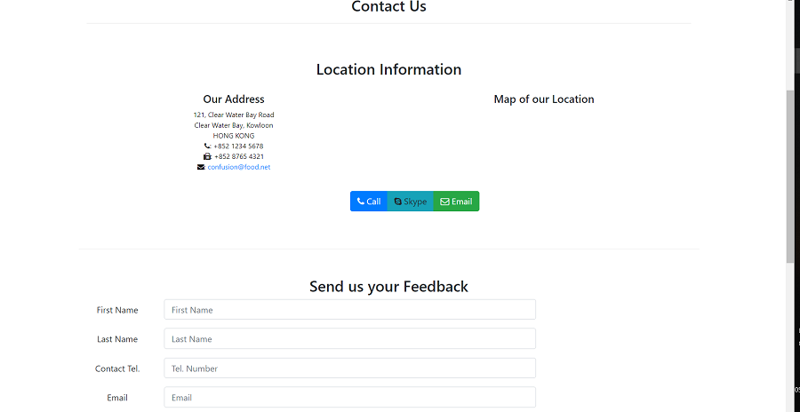
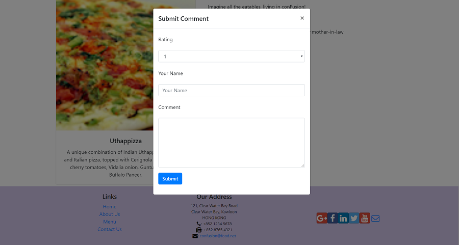

This is a restaurant web application built as a part of the ReactJS course on coursera.

This is a restaurant web application which has some of typical features that you would find in a restaurant application.

You can view the menu for the restaurant.
You can rate the dishes.
You can comment on the dishes.
You can view the history of the restuarant.
There is a login form to enter credentials.
There is also a feedback form in the contact us tab.

Some of the screenshots from the application are:

Screenshot1

Screenshot2

Screenshot3

Screenshot4

Screenshot5

Screenshot6

Screenshot7

Screenshot8

